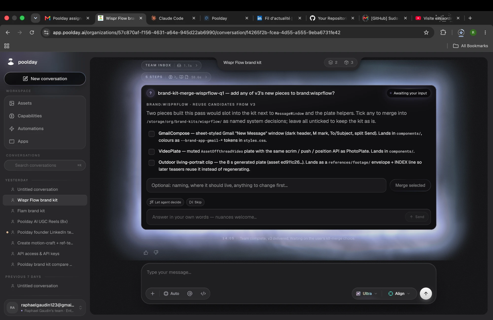
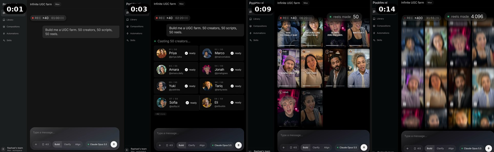
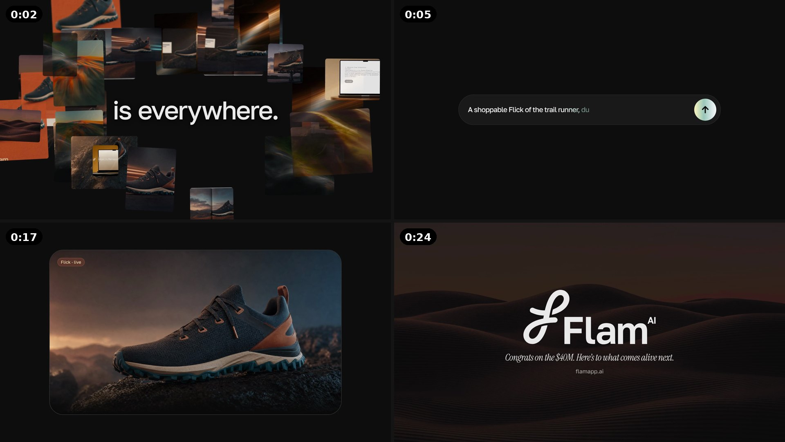
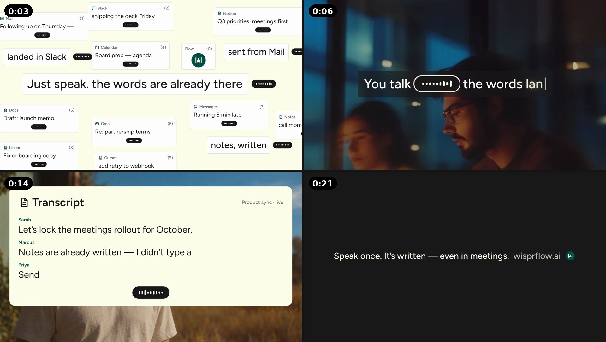
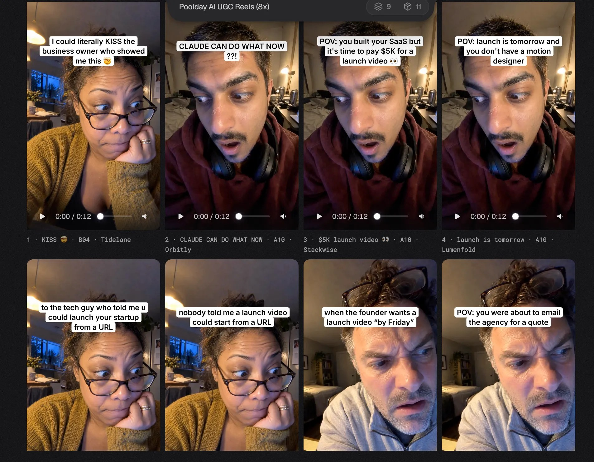
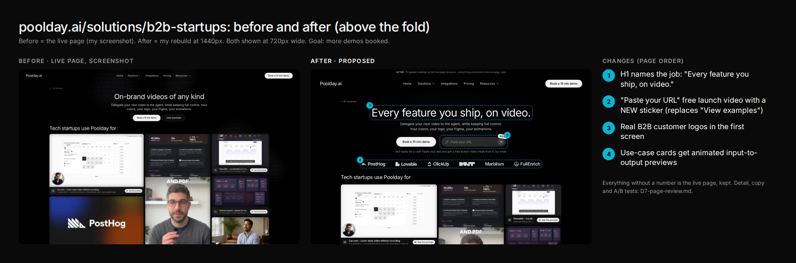
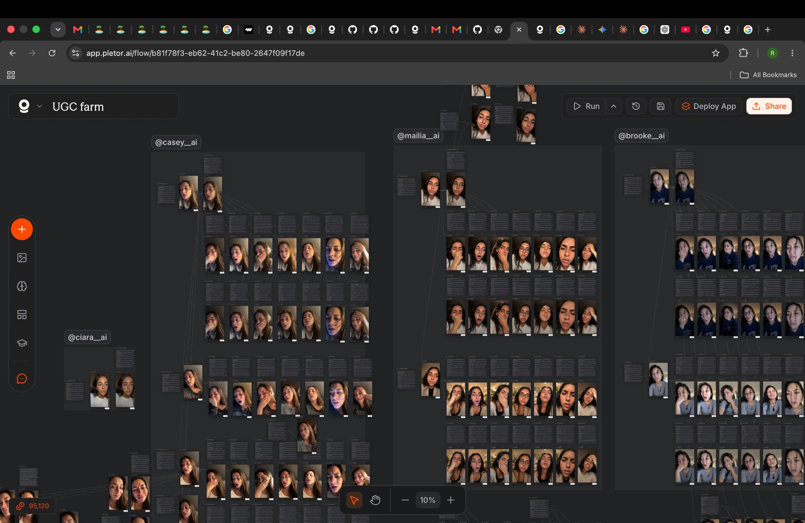

# Poolday Growth Assignment: Deliverables

**Raphael Gaudin** · 48-hour assignment · **[PLACEHOLDER: submission date]**

---

## TL;DR

| # | Deliverable | Link | Key number |
|---|---|---|---|
| D1 | LinkedIn post + video, for the CEO's account | [video](D1-linkedin/infinite-ugc-farm.mp4) · [caption + alternatives](D1-linkedin.md) | 15s · 4:5 · one prompt, made entirely in Poolday |
| D2 | Prospect video: Flam ($40M Series B) | [video](D2-prospect-videos/flam-series-b-teaser.mp4) · [shot list + email](D2-prospect-videos/README.md) | 25s · 2 messages · 50 min of agent time, brand kit included |
| D2 | Prospect video: Wispr Flow ($280M Series B) | [video](D2-prospect-videos/wispr-flow-meetings-teaser.mp4) · [shot list + email](D2-prospect-videos/README.md) | 22s · 3 messages (v1 → v3) · 55 min, brand kit included |
| D3 | Agent loop: find → qualify → Poolday → human gate → email | [how it ran](D3-loop/README.md) · [code](../loop/) | 37 leads → 5 qualified → a Poolday video through a webhook in 4 min (≈$11) → approved → email drafted |
| D4 | AI UGC on Instagram | [@natecreates99](https://www.instagram.com/natecreates99/) · [the 8 reels in Poolday](https://app.poolday.ai/organizations/57c870af-f156-4631-a64e-945d22ab6990/conversation/055fb41d-de19-4007-a037-3f7a459a7f2a) | 8 reels made · [PLACEHOLDER: n] posted · [PLACEHOLDER] views |
| D5 | Growth idea: "Paste a link. Watch the video." | [write-up](D5-growth-idea.md) · [mockups](D5-mockups/walkthrough.mp4) | $15k in 3 gated stages · ≈$19 per video, ≈$380 per booked demo at 5% (est.) |
| D6 | Video review: PostHog **and** Upflow | [review](D6-video-review/D6-video-review.md) · [remakes](D6-video-review/remake/README.md) | Top 3 changes each · both remade: Upflow 23 → 16s, PostHog 24 → 20s |
| D7 | Page reviews: home + b2b-startups (+ pricing) | [review](D7-pages/D7-page-review.md) · [before/after](D7-pages/compare/) | 15 numbered changes, each with its A/B test · every page rebuilt before/after |
| D8 | Bonus: Poolday's own Instagram | [static ad](D8-instagram/poolday-static-ad.png) · [notes](D8-instagram/README.md) | ad remake · profile-picture fix · 12 ideas for use-case shorts |

**Key numbers**
- UGC views: [PLACEHOLDER] across [PLACEHOLDER] reels (best: [PLACEHOLDER]).
- Credits: 835,270 of 2,000,000 spent (≈ $835 of $2,000, 42%). Other tools: [PLACEHOLDER: $ spent outside Poolday, of the $300 allowed].
- Poolday agent time: 5h01m across 9 conversations. A first video with its brand kit took 49–56 min. The same brand again, through the D3 webhook, took 4 min (≈$11).
- Messages per video: 2 (Flam), 3 (Wispr Flow, v1 → v3), 1 (the automated D3 run).

---

## How I worked

**1. Read the agent guide first, and let it change the plan.** Runs take about an hour and a first video takes several prompts, so the long Poolday jobs (brand kits, prospect videos) started at hour 0. Everything reusable was saved (brand kits, skills), so later videos would be cheap. My notes: `poolday/agent-guide-notes.md`.

**2. Two lanes, no idle time.** Poolday worked in one lane: 9 conversations, one per job, [PLACEHOLDER: n] at once at peak (table in "Time and credits"). In the other lane, Claude Code and I built the loop, the reviews, the remakes and this doc. Variants stayed inside one conversation, as the guide advises.

**3. Skills and brand kits first.**
- Two org skills, saved on day 1: **motion-craft** (pacing and motion rules from my motion-design manual) and **ref-teaser** (turn a reference video into a teaser, with one approval gate).
- A brand kit from each website. Flam's has 34 colours, animatable node cards, 18 imagery assets and motion and sound rules, and it flagged on its own that some scraped images showed another company's products. Wispr Flow's has 22 colours. Poolday's own kit was compared with mine and enriched.

**4. I picked the references and wrote what I love about each.** Flam: an ImagineArt launch video ("the easing and speed, and the continuity: tiles linked by lines"). Wispr Flow: a Skuve reel ("the clean light-grey UI world, numbered cards"). The skill copies cuts and rhythm, so the reference is the biggest creative lever.

**5. Options before committing.** UGC: actor photos → pick → voices → pick → scripts → batch (6 messages, 11 outputs). LinkedIn: directions first, then 4 outputs, and I picked A. Prospect videos: the skill's approval gate. After Wispr v3, Poolday asked which new pieces to merge into the brand kit so later Wispr videos are cheaper:



**6. Intent, not editing instructions.** My Poolday prompts said what and why (the angle, the reference, what I love about it) and left the execution to the agent, as the brief advises. Claude helped with briefs and critiques, never step-by-step edit lists. Critiques were timestamped mechanisms ("the grid holds 4s with only a cursor moving: cut to 1.5s"), never "make it punchier".

**7. Reuse is where the cost drops.** The first video per brand took about 50 min of agent time (≈$140). The same brand again, sent by the loop to the Automation webhook: 1 message, 4 min, ≈$11.

**8. Clear roles per tool.**

| Tool | Role |
|---|---|
| **Claude (chat)** | Hooks and scripts, LinkedIn and email copy, the first draft of the page review (it can browse) |
| **Claude Code** | Ranked the CSV, built the agent loop, the D6 remakes, the D7 page rebuilds and the D8 ads, kept the plan, runbook and methods log, assembled this doc |
| **Poolday** | Brand kits, skills, every video in D1–D4, and the automation. It decided the execution |

**9. Documented as I went.** Every step was logged the same day (what, tools, inputs, process, decision and why, output, time/credits, lessons): [METHODS.md](../METHODS.md), 55 entries.

---

## D1. LinkedIn post + video

**"Claude Opus 5.5 + Poolday = Infinite UGC farm"**, posted by the CEO.

- **Use case shown:** one message in Poolday, "Build me a UGC farm. 50 creators, 50 scripts, 50 reels.", and the agent casts the creators, writes the scripts and fills a wall of reels while a "reels made" counter climbs.
- **Why this angle:**
  - UGC at volume is what app and D2C marketers pay agencies and creators for every month, so the people who comment are buyers.
  - "[tool] + [tool] = [big outcome]" is the headline format that performs best for me.
- **Video:** [`D1-linkedin/infinite-ugc-farm.mp4`](D1-linkedin/infinite-ugc-farm.mp4) · 15s · 4:5 (1536×1920) · readable with the sound off (the prompt, the counter).

  
- **Process:** one prompt with creative freedom (`poolday/prompts/L3-ugc-studio-one-prompt.md`), made entirely in Poolday. One conversation: 2 messages, 4 outputs, 56 min of agent time. I picked output A (a sped-up screen capture ×40, no end card).
- **Post copy (the CEO's caption):**
  ```
  Claude Opus 5.5 + Poolday = Infinite UGC farm.

  One message:
  "Build me a UGC farm. 50 creators, 50 scripts, 50 reels."

  Poolday casts the creators, writes the hooks,
  films the reels and adds the captions.
  Running on Claude Opus 5.5.

  A year ago this was an agency and a month of work.
  Now it's one prompt.

  Want the exact prompt? Comment "UGC" and I'll send it.
  ```
- **First comment:** `Every reel is labeled as AI. Try it: poolday.ai ?utm_source=linkedin&utm_campaign=ceo-ugc-farm`
- **Lead capture:** everyone who comments "UGC" gets the prompt by DM, and their company goes into the D3 loop to be scored ([D1-linkedin.md](D1-linkedin.md) §4).
- **Honesty:** the video is a sped-up dramatization made in Poolday (its counter runs into the thousands), so the caption claims no count. The real batch behind it is the 8 reels in D4.
- **Cover image:** set the LinkedIn thumbnail to the 0:09 frame (the wall of reels). Frame 0 is a dark, almost empty screen.
- Other angles and headline options: [D1-linkedin.md](D1-linkedin.md).

---

## D2. Two prospect videos

### Why these companies: fresh rounds with a named buyer
> I picked companies that raised in the last ~5 weeks and where the list names a marketing or creative decision-maker: fresh money plus an upcoming launch means they need video *now*, and there's someone to send it to.

Scoring on the Series B list (38 companies, Higgsfield excluded): (1) freshness of round, (2) a named marketing/creative buyer, (3) a visual product, (4) fit with video as a need. A filter on rounds in the last 90 days gave 9 companies. I removed those with no contact (Arcee AI, Standard Metrics) or a weaker segment/unverified HQ (Delightree, Flex).

| | Flam | Wispr Flow |
|---|---|---|
| Round | $40M Series B, 10 days before the analysis | $280M Series B, 38 days before |
| Buyer | CMO / Head of Product + Creative Director | VP Product Marketing + Head of Design, Marketing |
| Why | Freshest round with contacts. They sell interactive content to enterprise marketers, so they judge visual quality professionally | Largest fresh round on the list. Design-led brand, and the move into meetings means a launch is coming |
| Angle | "Your Series B announcement film" | "What your meetings launch could look like" |
| Video | [`flam-series-b-teaser.mp4`](D2-prospect-videos/flam-series-b-teaser.mp4) · 25s · 16:9 | [`wispr-flow-meetings-teaser.mp4`](D2-prospect-videos/wispr-flow-meetings-teaser.mp4) · 22s · 16:9 |
| Prompts / agent time / credits | 2 messages · 50 min, brand kit included · ≈140k credits (est.) | 3 messages (v1 → v3) · 55 min, brand kit included · ≈155k credits (est.) |





Shot lists, a self-review against my own pacing rule, and both emails: [D2-prospect-videos/README.md](D2-prospect-videos/README.md).

Backup: **Convex** ($57M, open source, so the skill can use its real UI components). Not made: the loop's live test reused the Wispr Flow kit instead (4 min, ≈$11), and the loop's rubric later scored Convex 67, just under the bar.

### How they were made
- Brand kit from the website → my ref-teaser and motion-craft skills + a reference video I chose, with what I love about it written as mechanisms → the skill's approval gate (script, look, routing) → iteration (Wispr Flow went v1 → v3: a real video plate and a Gmail compose screen were added).
- Not done: the brief's other route ("build it in threejs, most impressive video possible") as an A/B against the skill. First item in "What I'd do with more time".
- **Outreach drafts:** Flam → Karthik (CMO), a new draft that passes the loop's email rule checks. Wispr Flow → Carolyn (VP Product Marketing), the loop's draft ([`D3-loop/wispr-flow-email-sample.eml`](D3-loop/wispr-flow-email-sample.eml)) with the v3 teaser's link swapped in. Both are in [D2-prospect-videos/README.md](D2-prospect-videos/README.md).

---

## D3. Agent loop

**Find → qualify → Poolday makes the video → human validation → email draft. Run live on 26 Sep.** The walkthrough, with 13 screenshots of the live run: [D3-loop/README.md](D3-loop/README.md). Code: [`loop/`](../loop/) (Python standard library, 40 tests).

```
[Find: the Series B list + a funding-news RSS source] → dedupe, drop Higgsfield
 → [Pre-score 0–100 in code: freshness 40 · buyer 25 · B2B 15 · video fit 20]   (under 45: cut)
 → [Qualify: 5 criteria × 20, justification, video angle, buyer]                (70+ kept; no named buyer = out)
 → [Poolday: the lead is POSTed to an Automation webhook, the agent makes the video]
 → [Return: the video link is pasted at the gate (Poolday can't call back yet)]
 → [HUMAN GATE: approve · reject · regenerate with a note]
 → [Email draft for the named buyer → .eml with a clickable animated preview]  → the CEO sends it
```

- **Live run:** 37 leads in → 10 cut by the pre-score → 27 scored → 5 qualified → Wispr Flow sent to Poolday (HTTP 202) → Poolday reused the saved Wispr composition and rendered a 22s video in 4 min (≈$11) → approved at the gate → email to Carolyn (VP Product Marketing) drafted and exported.
- **Qualification:** Flam 99, TwelveLabs 79, Blacksmith 77, Delightree 77, Wispr Flow 76 (the rubric, answered in Claude Code since there was no API key).
  - **Checks:** 4 of the 5 are also the picks of the loop's offline formula; the rank correlation with the pre-score is 0.83; it matches the D2 picks I made by hand.
  - **Limits,** and how to validate with real outcomes: in the README.
- **The human gate:** nothing goes out unless a person approves the video. "Regenerate with a note" sends the lead back to Poolday with the note.
- **The Poolday step:** the API is locked for trial orgs and being deprecated (per the CEO), so the loop triggers a Poolday **Automation webhook**. Poolday's agent has no outbound network, and the Automation's Output has no webhook destination. So the video link comes back with one paste at the gate. With an Output webhook, that paste disappears: the loop already verifies signed callbacks.
- **Finding new leads:** the live run used the Series B list. The funding-news source (TechCrunch, PR Newswire, Business Wire… over RSS) is built and tested offline. It still needs a contact-enrichment step: a news item has no named buyer, and the rubric knocks those out.
- **Emails the CEO sends:** Wispr Flow (`D3-loop/wispr-flow-email-sample.eml`, with its preview) and Flam (in the D2 README).

---

## D4. AI UGC on Instagram

- **Account:** [@natecreates99](https://www.instagram.com/natecreates99/). New account, professional mode (reel insights). Warmed up before posting: 8 followers, 45 following on 26 Sep.
- **Posting limit:** from my experience, a new account shouldn't post more than **once a day**, or it risks a shadowban. I posted 3 on day 1 to fit the 48 hours, then stopped. The 4th goes up the next day. I warmed the account up with normal activity (follows, likes, comments) and no posts, starting before any video production.
- **Method:** reused my AI UGC method from Pletor (see appendix), inside Poolday: actor photos → pick → voices → pick → scripts → batch as variants in one conversation. The Poolday run "Poolday AI UGC Reels (8x)" produced 8 reels (52 min of agent time).
- **All 8 reels, in Poolday:** [conversation "Poolday AI UGC Reels (8x)"](https://app.poolday.ai/organizations/57c870af-f156-4631-a64e-945d22ab6990/conversation/055fb41d-de19-4007-a037-3f7a459a7f2a). They are 12s each, in 9:16, with 3 AI creators and 8 different hooks.

  
- **The 8 hooks** (on-screen text in frame 1):
  1. "I could literally KISS the business owner who showed me this 🤯"
  2. "CLAUDE CAN DO WHAT NOW ??!"
  3. "POV: you built your SaaS but it's time to pay $5K for a launch video 👀"
  4. "POV: launch is tomorrow and you don't have a motion designer"
  5. "to the tech guy who told me u could launch your startup from a URL"
  6. "nobody told me a launch video could start from a URL"
  7. "when the founder wants a launch video "by Friday""
  8. "POV: you were about to email the agency for a quote"
- **What impressed me:**
  - Poolday made a smart call at every step of this batch.
  - The AI creator **turns the camera around and films the Poolday demo** on the laptop. I didn't think that was possible. Before (see the appendix), I generated only the hook with AI and filmed the demo part myself, by hand, with my iPhone pointed at my Mac. Here, the whole reel comes out of one conversation, with no manual filming.

| # | Hook (frame 1) · cover caption (the laptop demo) | Posted | Views at +12h | Views at +24h | Views at submission |
|---|---|---|---|---|---|
| 1 | [to confirm: probably "POV: you built your SaaS but it's time to pay $5K for a launch video 👀"] · "it did the $5K part from ONE link" | [26 Sep, morning](https://www.instagram.com/reel/DdvmblCsJN1/) | 0 (avg watch 9s: stats not settled) | [PLACEHOLDER] | [PLACEHOLDER] |
| 2 | "to the tech guy who told me u could launch your startup from a URL" (face, reaction) | [26 Sep, 21:15](https://www.instagram.com/reel/DdwHhNmMUNj/) | [PLACEHOLDER] | [PLACEHOLDER] | [PLACEHOLDER] |
| 3 | "when the founder wants a launch video "by Friday"" · "done before lunch. from one URL". Caption "it was so fast im genuinely shocked lol", IG library audio (Total Eclipse of the Heart) | [26 Sep, ~21:40](https://www.instagram.com/reel/DdwK82gsVSt/) | [PLACEHOLDER] | [PLACEHOLDER] | [PLACEHOLDER] |
| 4 | [PLACEHOLDER: 27 Sep, needed for 3 < n] | [PLACEHOLDER] | [PLACEHOLDER] | [PLACEHOLDER] | [PLACEHOLDER] |

- **Total views:** [PLACEHOLDER] · **Best hook:** [PLACEHOLDER] · **Leads/profile clicks:** [PLACEHOLDER]
- **Early read (+12h):** a 2-day-old account's first reel gets almost no distribution. Check Account Status → recommendations eligibility before calling it a shadowban. The fixes for the next posts: Trial reels (shown to non-followers first), a face plus text hook in frame 1, IG library audio (applied on reel 3), fewer follows per day, and the "AI info" label on.
- **Format note:** each reel opens on the AI creator's face with the hook, then the creator turns the camera to the laptop running Poolday. The covers show that laptop shot, so the profile grid reads as product demos (`assets/d4/profile-3-reels.png`).
- Screenshots: `assets/d4/`.

---

## D5. Growth idea: "Paste a link. Watch the video."

**The idea.** A free page on poolday.ai. You pick one of three things Poolday already makes well, give it a link, pick a style card and leave a work email, and you get the video:
- a **launch video** from your website URL;
- **podcast clips** from an episode;
- an **AI product ad** from a URL and a product photo.

It's the Submagic mechanic (upload → pick "Hormozi" → done), applied to Poolday's best outputs. The result page's main button is **"Book a 15 min demo"**: "Want this for your real launch? It takes one call."

**Why it books demos:**
- The visitor sees their own brand in a Poolday video before any call.
- Credits go only to work emails at real companies; personal emails are refused on the spot.
- So every video is also a qualified lead with a name, a role and a company.

**Distribution: "Poolday can actually do it."** On X, posts claim "AI made this video with one prompt", and the claim is often faked. We remake the video for real in Poolday, screen-record the run, and reply with it and the link. Precedent: Motion/Mosaic replied to big threads with "tag us to get a video explaining this thread".

**Quick win: ride the "AI motion designer" trend.** It's the format of the week on X: "I paid $1,000 for a video like this a year ago. Now I made it with Opus 5.5 in 30 minutes" (e.g. @tdinh_me, 4k views in 4h; screenshot: `assets/trend-opus-motion-design-tweet.png`).
- **The play:** 2–3 posts a week of before/after remakes of well-known brands' videos, made in Poolday, each with the prompt.
- **The format already works:** my D6 remakes are exactly this before/after, built in code.
- **Honesty rule:**
  - name a model only if Poolday confirms that it ran on it;
  - publish another brand's remake only with their OK.

**Budget:** $15k in three gated stages. Each stage opens only when the previous one hits its trigger:
1. $2k manual pilot, 2 weeks;
2. $5k public page;
3. $8k scale.

At ≈$19 per delivered video (est.) and 5% video → demo, that's ≈$380 per booked demo. The pilot's job is to push both numbers down. A repeat video on a saved kit already measured ≈$11 (D3).

**Mockups:** seven screens in Poolday's app style (`D5-mockups/`, the whole path in `walkthrough.mp4`). **Full write-up:** product flow, styles, why it beats Motion, cost model, risks: [D5-growth-idea.md](D5-growth-idea.md).

---

## D6. Video review: both, PostHog GenAI launch and Upflow faster payments

Full review, timestamped tables and the prompts I'd give Poolday: [D6-video-review.md](D6-video-review/D6-video-review.md).

**Upflow (23.3s): a great idea with lost rhythm.**
- The hook takes ~10s.
- The opening question ("Did Acme pay invoice #2041 yet?") is never answered, because the product never appears.
- The best line (WorkMotion cut invoices 31+ days overdue by 79%) is micro-text in the footer.
- At 1.5× speed it already feels better (`upflow-1.5x-quicktest.mp4`): the ideas are right, the holds are too long.

Top 3 changes:
1. Show the product answering the question.
2. Cut every hold to reading time + 0.3s (target 14–16s).
3. Give −79% its own full card.

**PostHog (24.4s): beautiful, but not PostHog.**
- It uses 3D clay renders, while PostHog is a 2D brand (flat, hand-drawn hedgehogs).
- The climax ("It's live") is the smallest text in the film.
- The product gets 2s of tiny tabs.
- The end card is a web footer pasted into a film, with the old logo.

Top 3 changes:
1. Go 2D, in PostHog's own illustration style.
2. Replace the slide with an animated sign-off.
3. Show real product proof at full frame.

**Upflow's first 5 seconds, rewritten (and built):**
- **0.0–1.5s:** the question types fast, with a key click on every letter.
- **1.5–3.6s:** 64 questions in 6 languages pop in around it on the beat.
- **3.6–4.0s:** the swarm implodes into Upflow's blue dot.
- **4.0s:** the dot floods the frame: "Something simple."
- **5.9s:** the product answers the question.

**Proof: both remade,** 100% on each brand, built in code with Claude Code (not in Poolday):
- Upflow: 23.3 → 16.4s.
- PostHog: 24.4 → 19.8s, in 2D with PostHog's real hedgehogs and the 2026 logo.
- Before/after, side by side: `D6-video-review/remake/*-compare.mp4`.
- The PostHog one is a private spec piece: the hedgehogs are licensed art.

**Cross-cutting finding: Poolday's videos are too slow.** It shows in all three videos I looked at: the PostHog and Upflow reviews, and a post picked at random from the CEO's LinkedIn ("Businesses have no excuse left for not making…", linkedin.com/posts/alexeichemenda_…). **The scenes are too slow, and the first 3 seconds are wasted.** In the LinkedIn one, the first 3s are just a blur clearing. People decide to scroll in about 3 seconds.
- **The fix, as a default:**
  - something meaningful on screen in frame 1: the product, a claim, a face, or a number;
  - no blur-in or fade-in openers;
  - average shot ≤1.2s;
  - text holds for reading time + 0.3s;
  - the hook is fully stated by 2s.
- **How to ship it:** a built-in "social pacing" preset/skill that is on by default for social formats. My D6 remakes show the difference side by side: Upflow shows the product at 6s instead of never, and the original still hasn't shown it at 8.5s.

**Root cause, as product feedback:**
- A pacing skill is on by default for social.
- The brand kit captures the brand's visual *medium* (PostHog = 2D illustration), not only the logo, colours and fonts.

---

## D7. Page reviews: poolday.ai and /solutions/b2b-startups (+ /pricing as a bonus)

Full review: [D7-page-review.md](D7-pages/D7-page-review.md). Each page is rebuilt before/after on the live page's own structure, with only the numbered items changed (`D7-pages/compare/`).

**Why each page loses demos:**
- **Home:**
  - the demo is the only path, so visitors who aren't ready for a call leave;
  - "Meet Poolday." never says what Poolday is;
  - nothing asks for the demo between the proof and the footer.
- **B2B startups:**
  - the H1 names the product, not the startup's job;
  - the second button only scrolls;
  - there are no logos in the first screen;
  - the 9 use cases are text-only.
- **Pricing (bonus):** "$1,250 in credits" doesn't say how much video that buys.

**Top 5 changes.** Each has an A/B test and a guardrail. The primary metric is booked demos per unique visitor.
1. **B2B hero:**
   - the H1 becomes "Every feature you ship, on video.";
   - a **"Paste your URL"** field (a free launch video by email, = D5) replaces "View examples".
2. **Home:** "Watch a 2-min build" next to "Book a 15 min demo", for visitors who aren't ready to call.
3. **Pricing:** "$1,250 in credits · ≈ 50–250 finished videos", derived from Poolday's own "~$5–25 per video".
4. **Home:**
   - "Meet Poolday. An agent that plans, makes and fixes the whole video.";
   - "Book a 15 min demo" right under the features.
5. **B2B:** each of the 9 use-case cards gets an animated input → output preview.



---

## My commitment: post about Poolday every day
I'd post every day on X and LinkedIn about Poolday. It genuinely excites me. The content engine is ready:
- **Formats that rotate:**
  - use-case listicles ("Top 5 Poolday use cases");
  - before/after remakes of well-known videos (the "AI motion designer" trend);
  - "Same prompt, 4 apps" comparisons;
  - "Claude Opus 5.5 + Poolday = Infinite UGC farm" style equations;
  - replies with proof under "AI can't do this" threads;
  - my own before/after, e.g. "I used to film the demo with my iPhone pointed at my Mac. Now the AI creator turns the camera around and films it.";
  - build-in-public updates from the prospect loop and the UGC account.
- **Cadence:**
  - X: 1 post and 3–5 proof replies a day.
  - LinkedIn: 1 post a day, founder voice, the best performer from X re-cut.
- **Every post ends in a measurable action** (comment a URL or a number), which feeds the lead loop (D3).
- **Tracked weekly:** posts, views, URL comments, demos booked.

## D8 (bonus): Poolday's Instagram
- **The static story ad, remade** (`D8-instagram/poolday-static-ad.png`): old vs new in one 9:16 image with a big **VS**. Top, grey: "Other AI video tools", a paused video of the "LOCAL AI SLOP" sign. Bottom, colour: "Made with Poolday", a pro motion frame for the demo brand Lumen, with its brand kit superposed and tagged "built by AI from lumen.com". Copy: "Your URL in. Your brand out." (Replace the third-party slop image before paid use.) An animated version also exists (`poolday-ad.mp4`).
- **Why:**
  - The current ad is a static text card, set in monospace + cyan, which is off Poolday's own brand.
  - The remake opens on an "AI SLOP" stamp in the first second, flips to the same ad done well, shows the brand kit being learned, then a wall of 12 on-brand formats, and ends on Poolday's real end card (slot-machine keyword roll, iris rule).
- **Profile picture:** the logo is cropped in the circle ("Poolday.a"). Use the mark alone, centered (`D8-instagram/profile-picture-proposal.png`).
- **Content engine:** 12 short motion use-case videos, titled with the kit's own `<input> to <output>` formula (URL to launch film, podcast to 10 clips, one video to 5 formats…), one a day. List in `D8-instagram/README.md`.

## What I'd do with more time

- Run the brief's other route as an A/B test: my ref-teaser skill vs. "build it in threejs, most impressive video possible", on the same company.
- Turn on the funding-news source with a contact-enrichment step, so the loop finds new leads every week beyond the list.
- Ask Poolday for an Output → Webhook (or API access), to remove the one paste in the loop.
- A/B test the D7 changes with the demo funnel measured end to end (CTA view → click → booking → show-up).
- Pilot D5 with 2–3 style templates and a daily credit cap.
- Scale UGC: more warmed accounts, TikTok and YouTube Shorts, and more variants of the best hook.
- Apply my own pacing rule to my videos: Flam's 4s grid hold and Wispr Flow's 7s outro.

---

### Time and credits (Poolday, 24–26 Sep 2026)
**Credits: 835,270 spent of 2,000,000 (≈ $835 of the $2,000 budget, 42%). 1,164,730 left.**
- By day: 24 Sep ≈ 25k (setup), 25 Sep ≈ 400k (read from the Usage chart), 26 Sep 409,800 (exact, 328 events).
- By category: Agents 639,531 (77%). The other 23% sits in categories the screenshot doesn't break down.
- Source: Settings → Usage (30 days), 26 Sep evening.

**Agent working time: 5h01m across 9 conversations.** This is Poolday's own estimate: the sum of gaps between the agent's activity timestamps, with pauses over 10 min left out.

| Poolday conversation | Deliverable | Agent time | Messages | Outputs |
|---|---|---|---|---|
| Opus 5.5 + Poolday: Infinite UGC farm (15s LinkedIn) | D1 (the CEO's post) | 56m | 2 | 4 |
| Wispr Flow brand kit | D2 Wispr Flow (brand kit + teaser v1–v3) | 55m | 3 | 3 |
| Poolday AI UGC Reels (8x) | D4 (8 reels) | 52m | 6 | 11 |
| Flam brand kit | D2 Flam (brand kit + teaser) | 50m | 2 | 1 |
| Poolday founder LinkedIn teaser: free launch video | D1 (angle #2 teaser) | 49m | 1 | 1 |
| Create motion-craft + ref-teaser skills | Setup (2 org skills) | 25m | 3 | 0 |
| Poolday brand kit compare + enrich | Setup (Poolday kit) | 7m | 1 | 2 |
| New order → product clip: incoming webhook | D3 (automated run from the loop) | 4m | 1 | 1 |
| API access & API keys | D3 (research) | 3m | 2 | 0 |

**What the numbers say:**
- Poolday doesn't expose credits per conversation (its agent can't see billing). Pro-rata on agent time, the average is ≈ 2,800 credits per agent-minute. That makes a first video with its brand kit, skills and iterations ≈ 140k credits (≈ $140).
- **The automated D3 run, which reused the Wispr kit and composition, took 4 minutes, ≈ 11k credits (≈ $11).** That's inside the site's "~$5–$25 per finished video".
- So the first video per brand is expensive, and every video after it is cheap. That's the case for the loop and for saved kits and skills. These per-conversation credit figures are estimates; only the totals above are exact.

**Built in Poolday:**
- 3 brand kits: Flam (Golos Text + Geist Mono, 34 colours), Poolday (Inter + Fraunces, 24 colours), Wispr Flow (EB Garamond + Figtree, 22 colours).
- 2 org skills: motion-craft, ref-teaser.
- 10 memories.
- 1 webhook automation.

Screenshots: `assets/poolday-final/`.

---

## Appendix

**Prior experience: the AI UGC farm I built for Pletor**



- **How it worked:** four AI creators (@casey_ai, @mailia_ai, @brooke_ai, @ciara_ai), each with dozens of hook variants. AI made only the hook, the first seconds of reaction to camera. I filmed the product demo part myself, by hand, with my iPhone pointed at my Mac.
- **What changed with Poolday (D4):** the AI creator turns the camera around and films the demo too, so the whole reel is generated in one conversation.
- [PLACEHOLDER: volume and results of the Pletor farm]
